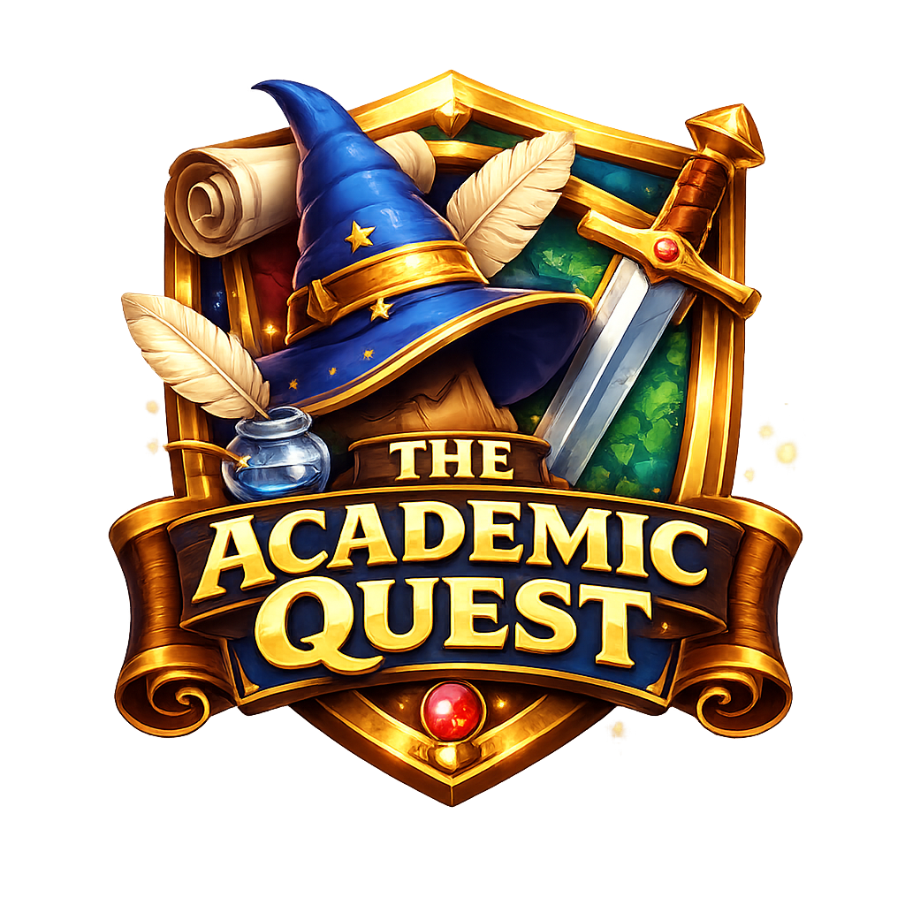

<p align="center">
  
</p>

---

# 🎮 The Academic Quest

> Transformando Projetos Acadêmicos em Aventuras Épicas

**The Academic Quest** é um aplicativo educacional que transforma o **Projeto Integrador e trabalhos acadêmicos** em uma experiência gamificada inspirada em **RPG**.

No aplicativo, tarefas viram **missões**, grupos viram **clãs**, e o progresso acadêmico se transforma em **evolução do personagem**.

O objetivo é **aumentar o engajamento, organização e colaboração entre estudantes**, reduzindo atrasos e melhorando a qualidade dos projetos.

---

# 📚 Problema

Muitos estudantes enfrentam dificuldades durante projetos acadêmicos em grupo:

* falta de organização das tarefas
* divisão confusa de responsabilidades
* baixa motivação
* prazos perdidos
* dificuldade do professor em acompanhar o progresso

Esses fatores frequentemente resultam em:

* trabalhos de baixa qualidade
* conflitos em grupos
* desmotivação dos alunos

---

# 🧠 Solução

O **The Academic Quest** aplica **gamificação inspirada em RPG** para transformar o projeto acadêmico em uma jornada interativa.

### Principais conceitos

| Elemento Acadêmico        | No App           |
| ------------------------- | ---------------- |
| Grupo de trabalho         | Clã              |
| Tarefas                   | Missões          |
| Entregas parciais         | Boss Battles     |
| Progresso do projeto      | Mapa de campanha |
| Nota / feedback           | XP               |
| Responsabilidade do aluno | Classe           |

---

# ⚔️ Sistema de Classes

Cada integrante assume uma **classe baseada em suas habilidades**.

| Classe          | Função                                     |
| --------------- | ------------------------------------------ |
| 🧙 Escriba      | responsável pela escrita do trabalho       |
| 🛡 Paladino     | líder do grupo                             |
| 🏹 Ranger       | responsável por pesquisa e coleta de dados |
| 🧠 Estrategista | organização do projeto                     |
| ⚒ Artífice      | criação de slides e materiais              |

Isso ajuda a **definir responsabilidades claras dentro do grupo**.

---

# ❤️ Sistema de Vida (HP)

As entregas do projeto funcionam como **batalhas contra chefes (boss battles)**.

* se o grupo perde um prazo → o clã perde HP
* se um membro falha na sua tarefa → perde mais HP
* o grupo precisa cooperar para **manter o clã vivo**

Esse sistema cria **responsabilidade coletiva e engajamento**.

---

# ⭐ Sistema de Progressão

Alunos evoluem ao longo do projeto:

* ganhar **XP por tarefas concluídas**
* receber **itens virtuais**
* desbloquear **customizações de avatar**
* subir de **nível**

Isso transforma a nota acadêmica em **progresso visual e motivador**.

---

# 👥 Público-Alvo

* estudantes universitários
* turmas com **Projeto Integrador**
* grupos de **TCC**
* cursos que usam **metodologias ativas**

---

# 🌍 Impacto Educacional

O projeto contribui para o **ODS 4 – Educação de Qualidade** da ONU.

Benefícios esperados:

* maior engajamento dos estudantes
* melhor organização de projetos
* redução de evasão
* melhoria da colaboração entre alunos
* melhor acompanhamento por professores

---

# 🛠 Stack Tecnológica

### Frontend

* React Native
* Expo

### Backend

* Node.js
* Firebase

### Banco de Dados

* Firestore

### Autenticação

* Firebase Authentication

### Ferramentas de Desenvolvimento

* GitHub
* Trello
* Figma
* draw.io

---

# 🧱 Arquitetura

O projeto segue o padrão:

**MVC – Model View Controller**

Isso permite:

* separação de responsabilidades
* código mais organizado
* facilidade de manutenção
* escalabilidade

---

# 📦 Instalação

### 1️⃣ Clonar o repositório

```bash
git clone https://github.com/seu-usuario/the-academic-quest.git
```

---

### 2️⃣ Entrar na pasta

```bash
cd the-academic-quest
```

---

### 3️⃣ Instalar dependências

```bash
npm install
```

ou

```bash
yarn install
```

---

### 4️⃣ Rodar o projeto

```bash
npx expo start
```

---

# 📊 Funcionalidades Planejadas

* Cadastro e login de usuários
* Criação de clãs (grupos)
* Criação de missões (tarefas)
* Sistema de XP
* Sistema de classes
* Barra de HP do grupo
* Mapa de progresso do projeto
* Ranking de progresso
* Feedback do professor

---

# 🧪 Testes

Tipos de testes utilizados:

| Tipo                  | Objetivo                       |
| --------------------- | ------------------------------ |
| Testes Unitários      | validar funções isoladas       |
| Testes de Integração  | comunicação entre módulos      |
| Testes de Usabilidade | avaliar experiência do usuário |

Ferramentas:

* Jest
* React Testing Library

---

# 👨‍💻 Equipe

| Nome              | Função        |
| ----------------- | ------------- |
| Arthur Di Loretto | Desenvolvedor |
| João Gabriel      | Frontend      |
| Erik Benevides    | Documentação  |
| Guilherme         | UX/UI         |
| Gabriel Beretta   | QA / Tester   |

---

# 🎓 Projeto Acadêmico

Projeto desenvolvido para a disciplina de **Projeto Extensionista Integrador - Criação e Distribuição de Apps Educacionais Gamificados**.

Curso: **Tecnologia em Análise e Desenvolvimento de Sistemas**

Instituição: **UNIVAG**

Professor orientador: **Brendo Vale**

---

# 📜 Licença

Este projeto foi desenvolvido para fins acadêmicos.

---
